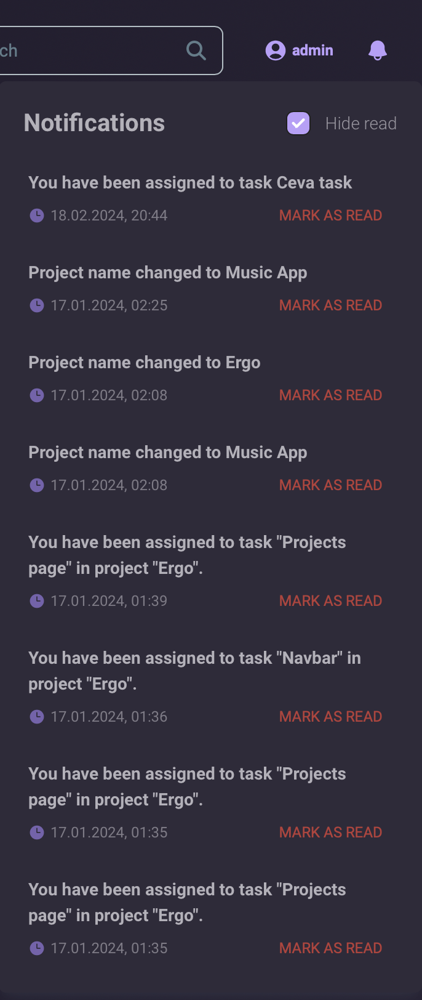

# Ergo: Project Management for Teams

Ergo is a web-based platform designed to simplify team project management.
Its core features streamline task workflows, collaboration, and progress visibility.

## Tech Stack
* Vite, Tailwind (Frontend)
* ASP.NET Core (Backend)
* PostgreSQL (Database)

## Pages
* **Project Dashboard:** A centralized view of tasks, deadlines, and team member activity.\
.png)

* **Project Page:** A detailed view of project tasks, deadlines, and team members.\
.png)

* **Task Management:** Create, assign, and track tasks. Enhance collaboration with descriptions, attachments, comments, deadlines, progress tracking, GitHub integration, and time logging.\
.png)

* **User Profiles:** Get to know your team members and endorse their skills with badges.\
.gif)

* **Login:** Log in to your account or use a Google account to sign in.\
.png)

* **Sign Up:** Create a new account.\
.png)

## Key Features
* **OpenAI integration:** Create a suite of tasks by simply describing your project in natural language.\
.gif)

* **GitHub integration:** Link your project to a GitHub repository and track your commits.\
.gif)

* **AWS S3 integration:** Add, view, download or delete images and other files.\
.gif)

* **Time logging:** Track the time spent on tasks.\
.gif)

* **Drag and drop:** Reorder tasks and columns with ease.\
.gif)

* **User search:** Find and add team members to your project.\
.gif)

* **Notifications:** Stay up to date with project activity.\

## Team Members
* **[George Duluta](https://github.com/GeorgeDenis)**
* **[Tudor Stroescu](https://github.com/tudstk)**
* **[Victor Grosu](https://github.com/vagrosu)**
* **[Ioan Grasu](https://github.com/lGnyte)**
* **[Mihai Galatianu](https://github.com/Galuca24)**
